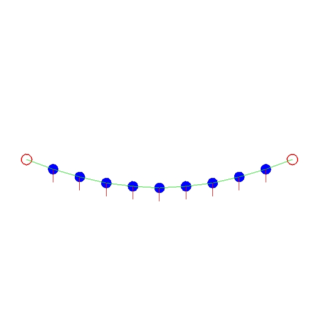
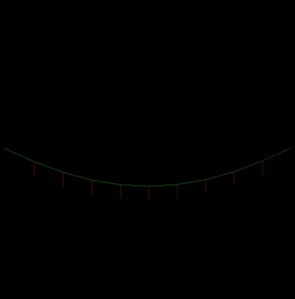
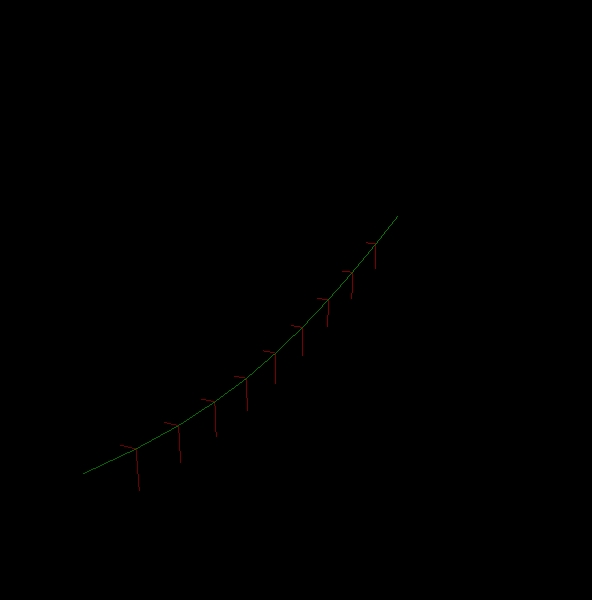
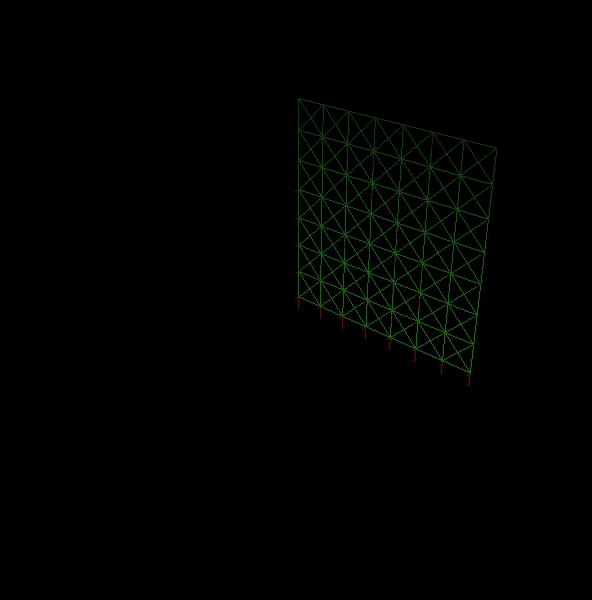
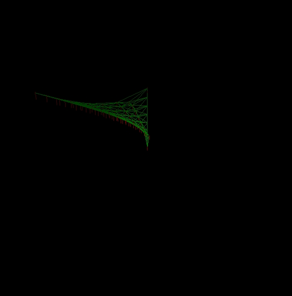
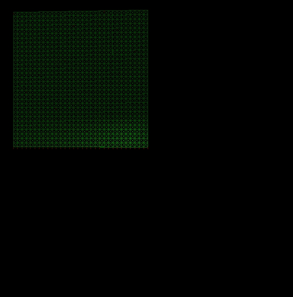
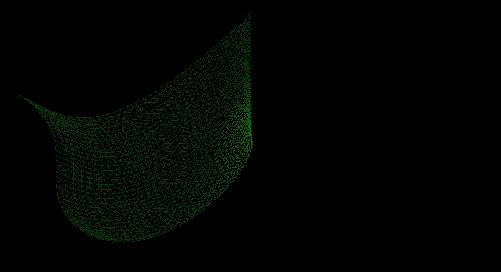

---
title: Rapport de Projet - Animation et Simulation
author: GOSSET Séverin & BIGUENET Denis
header-includes:
  \usepackage{booktabs}
  \usepackage{longtable}
  \usepackage{array}
  \usepackage{float}
  \usepackage{caption}
  \floatplacement{figure}{H}
--- 

# Introduction

Ce rapport décrit le projet d'Animation et Simulation, dans lequel nous devions faire un simulateur de drapeau en 3D, utilisant un système de masses-ressorts. Le but était d'avoir un drapeau qui bougeait, en fonction du vent et de la gravité.

# Progessions du projet

Afin de réaliser ce projet, nous sommes partis du code de la corde en 1D avec de la gravité, utilisant la librairie `G2X`. La première étape était donc de convertir la corde de G2X en G3X. Pour cela il suffisait de changer de librairie, et d'utiliser `glut` pour dessiner des lignes. On peut voir ici le résultat de la conversion. Dans un soucis de performances et surtout de lisibilité, nous avons choisi de ne pas représenter les masses car elle sont visibles en tant que points de connexions des liaisons.

{height=300px}

{height=300px}

L'étape suivante a été de passer de la 1D à la 3D. Pour cela, nous avons simplement dupliqué les calculs des forces et des positions pour les avoir une fois par dimension. En effet, le transferts des forces par les ressorts ainsi que l'effet des forces et de la vitesse sur la position de la masse était la même quelquesoit la dimension.

{height=300px}

L'étape suivante a été de passer du modèle de corde (un ligne de masses, reliés par des ressorts, représenté simplement par un tableau de masses) à un modèle de drapeau, c'est-a-dire un maillage de 2 dimensions de masses, reliés de differentes façon par les liaisons. Le principe ici a été de passer d'un simple tableau à un tableau en 2D pour les masses, et d'ajouter les liens au fur et à mesure. Le drapeau, quand il est statique, ressemble à ça, pour une taille de 8x8 :

{height=300px}

En mouvement, on obtient : 

{height=300px}

Ces résultats ne paraissent pas très satisfaisants, cependant cela est principalement dû à la taille du drapeau. Voici les résultat avec un drapeau 32x32 :

{height=300px}

{height=300px}

Cela semble bien plus correct, il reste légèrement étrange, cela est dû à deux effets : 

 - L'effet de "super-elasticité", comme si le drapeau était plus tendu à la base. Cela vient de la nature des ressorts-freins qui vont etre plus tendus car il y a plus de masse à porter près du mât. Pour contrer cet effet, nous avons tenté d'ajouter un coefficients qui réduirait la masse ou l'effet des ressorts sur les masses les plus éloignées du centre, mais le résultat obtenu divergeait complètement dès le lancement de la simulation.
 - L'approximation du vent, qui était réduit à un simple scalaire appliqué à la coordonnée $x$ de chaque masse. Nous aurions pu faire à la place une force qui variat en fonction du temps mais nous n'avons pas réussi à faire les "liaisons" correspondantes.
 
# Difficultés rencontrées

La première difficulté rencontrée a été de comprendre la corde 1D, et les equations qui la composait. Une fois ces formules comprises, il suffisait de les appliquer en 3D pour avoir un drapeau.

Ensuite, la plus grande difficulté (dans ce projet mais aussi dans le domaine en général), est de réussir à trouver des paramètres physiques qui permettent un rendu réaliste et cohérent. Nous avons, dans notre cas, réduit la raideur de base des liaisons, et gardé le reste tel quel.